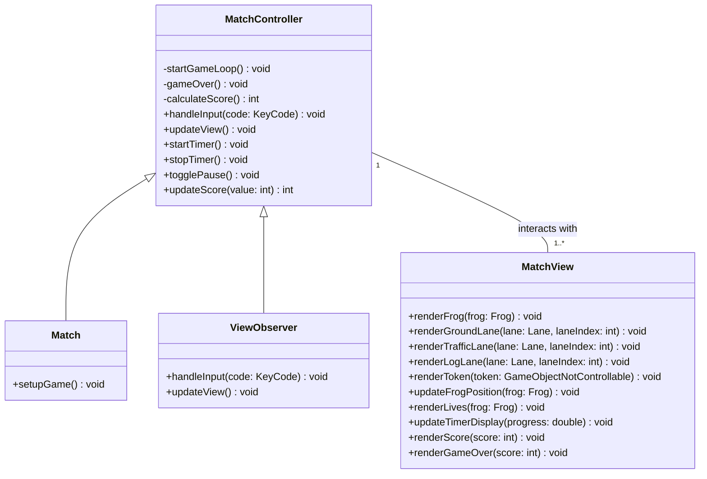
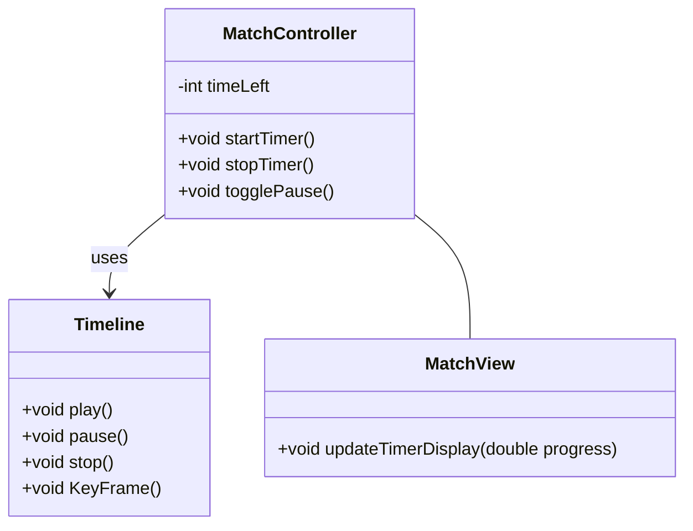
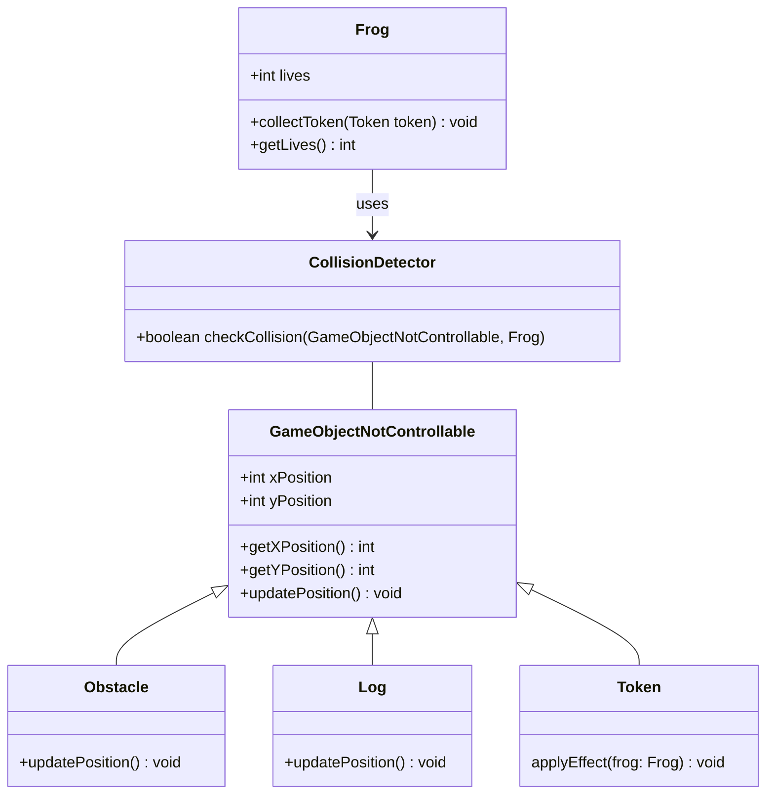
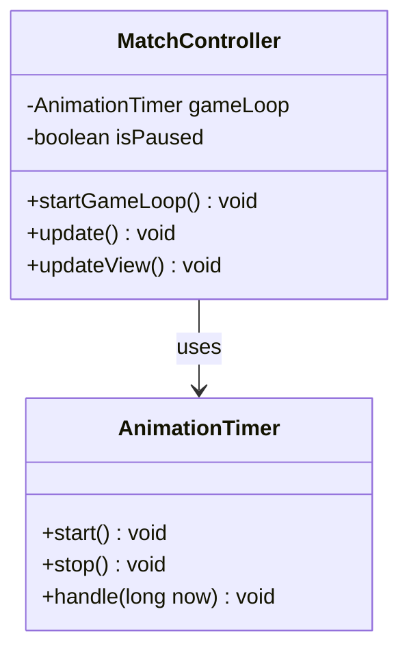
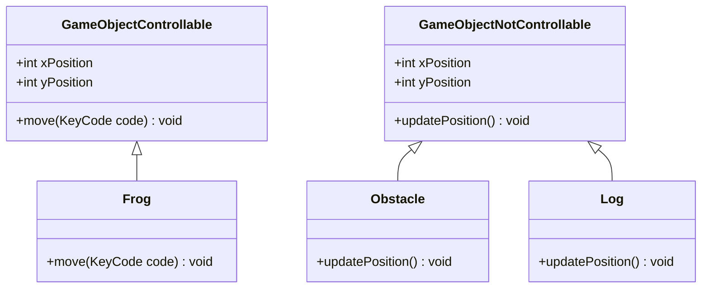

# Relazione del Progetto: Frogger

## Analisi

Il progetto consiste nella realizzazione di un videogioco ispirato al classico arcade *Frogger*. Si propone di realizzare una reinterpretazione del titolo originale, integrando le meccaniche di gioco classiche. L'obiettivo principale è di guidare una rana attraverso diverse corsie trafficate evitando ostacoli, raccogliendo bonus strategici e completando il percorso entro un tempo limite.

Il gioco è strutturato su livelli con difficoltà progressiva. Le meccaniche principali includono un sistema di raccolta oggetti, un timer dinamico e la possibilità di salvare i punteggi dei giocatori per promuovere una sana competitività.

---

## Requisiti

### Requisiti funzionali
- **[RF1] Schermata Menù**: Offre le seguenti opzioni:
  - `New Game`: Inizia una nuova partita.
  - `Settings`: Permette di regolare impostazioni come il volume.
  - `Quit`: Consente di uscire dall'applicazione in modo semplice e immediato.

- **[RF2] Inserimento Nome Giocatore**: Una schermata dedicata permette al giocatore di inserire il proprio nome prima dell'inizio della partita, garantendo che il punteggio venga salvato correttamente e possa essere confrontato nella classifica.

- **[RF3] Modalità di Gioco Classica**:
  - La rana si muove attraverso diverse corsie utilizzando i tasti freccia per navigare.
  - Elementi in movimento, come: 
    - *veicoli*: generano le collisioni e devono essere evitati per completare il livello
    - *tronchi*: utilizzati come vettori per spostarsi e attraversare i corsi d'acqua.
  - Possibilità di raccogliere gettoni che forniscono bonus, come estensioni del tempo o vite extra.

- **[RF4] Sistema di Collisione**:
  - La partita termina se la rana collide con un ostacolo e non dispone di altre vite o se il tempo a disposizione si esaurisce. Viene mostrata una schermata di `Game Over` con il punteggio ottenuto.

- **[RF5] Countdown Temporale**: Un timer visibile in basso allo schermo tiene traccia del tempo rimanente. Il conto alla rovescia aggiunge tensione e strategia al gameplay.

- **[RF6] Schermata di `Game Over`**:
  - Visualizza il punteggio raggiunto e offre opzioni per iniziare una nuova partita o chiudere il gioco.

### Funzionalità opzionali
- Livelli con difficoltà crescente che aumentano progressivamente la velocità e la densità degli ostacoli, introducendo nuove sfide a ogni progresso.
- Tronchi mobili per attraversare corsi d'acqua e altre meccaniche di navigazione strategica.
- Una classifica persistente per mostrare i migliori punteggi ottenuti dai giocatori.
- Condivisione sui social media dei risultati della partita, favorendo il coinvolgimento della community.
- Modalità di gioco personalizzabili con opzioni avanzate nel menù delle impostazioni.

---

## Analisi e modello del dominio

Il dominio di *Frogger* si basa su un insieme di entità principali, ciascuna con responsabilità e comportamenti specifici. Queste entità, come la rana, le corsie, gli ostacoli e i gettoni, lavorano insieme per creare una dinamica di gioco coinvolgente e strategica.

Gli elementi costitutivi il problema sono sintetizzati nella seguente figura.


Ogni classe definisce un comportamento specifico:
- **Match**: coordinatore principale del flusso di gioco. Responsabile dell’inizio del match e del collegamento tra le varie entità.
- **Frog**: rappresenta il personaggio principale controllato dal giocatore e fornisce le funzioni di movimento, raccolta dei gettoni e gestione delle vite.
- **Lane**: definisce una corsia di gioco con una velocità e una direzione specifiche composta da elementi non controllabili.
- **GameObjectNotControllable**: classe base per gli oggetti non controllabili. Possono essere ostacoli, tronchi o gettoni.
- **Obstacle**: definisce gli elementi dinamici del percorso che determinano le collisioni.
- **Token**: introduce elementi strategici attraverso effetti bonus.
- **Log**: rappresenta un elemento in movimento che può essere utilizzato come mezzo di trasporto tra 2 sponde.
- **CollisionDetector**: verifica se la posizione della rana è valida utilizzando bounding boxes per rilevare le collisioni.
- **PlayerScoreManager**: gestisce il salvataggio e il caricamento dei punteggi dei giocatori, e fornisce i migliori punteggi

Questa struttura consente una chiara separazione delle responsabilità, facilitando la manutenzione e l'espansione del progetto.

---

## Design

### Architettura

Il design del gioco segue il pattern MVC (Model-View-Controller), una scelta che garantisce modularità e facilita l'evoluzione del progetto. Ogni componente ha ruoli ben definiti:



- **Model**: Si occupa della logica del gioco e dello stato delle entità, come la posizione della rana e il timer.
- **View**: Rende l'esperienza visiva, occupandosi del disegno grafico e dell'interfaccia utente.
- **Controller**: Gestisce l'input dell'utente, traducendolo in azioni sul Model e aggiornamenti della View.

### Design dettagliato

#### Gestione del Timer
**Problema**: Garantire un sistema di countdown efficace e sincronizzato con il gameplay.

**Soluzione**:  Implementazione di un `Timeline` che aggiorna periodicamente la variabile timeLeft e notifica la View per aggiornare la barra sul display.



#### Collision Detection

##### Problema

Nel gioco, la rana si muove lungo le corsie evitando gli ostacoli o saltando su tronchi. Diventa quindi essenziale:
- verificare la validità di ogni movimento (non fuori dai bordi dello schermo o su una posizione occupata da un ostacolo).
- rilevare le collisioni con oggetti dinamici (es. veicoli).
- garantire fluidità nel gameplay mantenendo un'implementazione efficiente.

##### Soluzione

Il movimento è gestito dalla classe `Frog`, che calcola la nuova posizione in base alla direzione ricevuta. La classe `CollisionDetector` verifica se la posizione è valida utilizzando bounding boxes. Questa separazione migliora la modularità: `Frog` si occupa solo del movimento, mentre il `CollisionDetector` si concentra sulla logica di interazione.

##### Motivazioni

Separare il movimento e il rilevamento delle collisioni migliora la leggibilità e facilita i test unitari.
L’uso del sistema di bounding boxes per le collisioni è stato scelto per la sua semplicità ed efficienza.



#### Game Loop

##### Problema

Il problema da risolvere è la gestione del ciclo di gioco in un videogioco. Questo deve aggiornare continuamente lo stato dello stesso e renderizzare la grafica, garantendo reattività e fluidità. Questo include la gestione dell'input dell'utente, l'aggiornamento delle posizioni degli oggetti di gioco, il rilevamento delle collisioni e il rendering della grafica.

##### Soluzione

La soluzione proposta è l'implementazione del pattern **Game Loop** utilizzando la classe `AnimationTimer` di JavaFX.

##### Motivazioni

L'uso del pattern Game Loop è una pratica comune nello sviluppo di videogiochi, poiché garantisce un'esperienza di gioco fluida e reattiva. Inoltre, l'implementazione di un ciclo di gioco separato consente di mantenere il codice ben strutturato e modulare.



#### Template Method

##### Problema

All'interno del gioco si possono trovare diversi tipi di oggetti che devono aggiornare la loro posizione in base a specifiche regole di movimento. Ad esempio, la rana controllata dal giocatore si muove in base all'input della tastiera, mentre gli ostacoli e i tronchi si muovono automaticamente lungo le corsie. È necessario implementare il comportamento di movimento per ciascun tipo di oggetto di gioco in modo separato. Questo può portare a codice duplicato e difficile da mantenere.

##### Soluzione

Come soluzione si propone l'uso del pattern Template Method. Questo pattern permette di definire la struttura di un algoritmo, delegando alle sottoclassi la definizione di alcuni passaggi specifici. In questo modo, è possibile centralizzare la logica comune del movimento degli oggetti di gioco nella classe base, permettendo alle sottoclassi di specificare il comportamento particolare.

##### Motivazioni

L'uso del pattern Template Method permette di mantenere il codice ben strutturato e modulare, riducendo la duplicazione del codice e facilitando la manutenzione.


---

## Sviluppo

### Testing automatizzato

Per garantire la qualità del codice, sono stati implementati test automatizzati utilizzando JUnit. Questi test coprono vari aspetti del gioco, tra cui:
- **Collisioni**: Verifica della corretta gestione degli impatti tra rana e ostacoli.
- **Interazione con tronchi**: Controllo se la rana interagisce correttamente con il tronco e ottiene la velocità per rimanerci sopra.
- **Movimento limitato**: Validazione del movimento entro i limiti della dimensione della finestra.

Esempio di test JUnit:
```java
@Test
void testCollisionDetection() {
    assertTrue(detector.checkCollision(obstacle, frog), 
        "Should detect collision when frog and obstacle are at same position");

    // Move obstacle away and test again
    obstacle.setPosition(OBSTACLE_X + OBSTACLE_X, OBSTACLE_Y + OBSTACLE_Y);
    assertFalse(detector.checkCollision(obstacle, frog),
        "Should not detect collision when objects are apart");
}

@Test
void testLogInteraction() {
    assertFalse(frog.isOnLog(), "Frog should not start on a log");

    frog.setOnLog(true, LOG_SPEED, LOG_DIRECTION);
    assertTrue(frog.isOnLog(), "Frog should be on log after setting");

    int initialX = frog.getXPosition();
    frog.updatePosition();
    assertEquals(initialX + LOG_SPEED, frog.getXPosition(),
        "Frog should move with log speed when on log");
}

@Test
void testFrogBoundaries() {
    // Test right boundary
    frog.resetPosition(BOUNDARY_RIGHT, INITIAL_FROG_Y);
    frog.move(KeyCode.RIGHT);
    assertTrue(frog.getXPosition() <= BOUNDARY_RIGHT - MOVE_DISTANCE,
        "Frog should not move beyond right boundary");

    // Test left boundary
    frog.resetPosition(0, INITIAL_FROG_Y);
    frog.move(KeyCode.LEFT);
    assertTrue(frog.getXPosition() >= 0,
        "Frog should not move beyond left boundary");

    // Test bottom boundary
    frog.resetPosition(INITIAL_FROG_X, BOUNDARY_BOTTOM);
    frog.move(KeyCode.DOWN);
    assertTrue(frog.getYPosition() <= BOUNDARY_BOTTOM - MOVE_DISTANCE,
        "Frog should not move beyond bottom boundary");

    // Test top boundary
    frog.resetPosition(INITIAL_FROG_X, 0);
    frog.move(KeyCode.UP);
    assertTrue(frog.getYPosition() >= 0,
        "Frog should not move beyond top boundary");
}
```

### Note di sviluppo

#### Vanni  

- Algoritmo per la gestione dell'interazione rana/tronco:

  **Dove**: `src/main/java/it/unibo/frogger/controller/CollisionDetector.java`
  
    **Permalink**:
    https://github.com/giuliavanni/pss24-25-Frogger-Rambaldi-Vanni/blob/master/src/main/java/it/unibo/frogger/controller/CollisionDetector.java#L54-L109 
  
    **Snippet**:  
 ```java
Iterator<GameObjectNotControllable> iterator = objects.iterator();
    while (iterator.hasNext()) {
        GameObjectNotControllable obj = iterator.next();
        if (checkCollision(obj, frog)) {
            ...
            <controllo delle collisioni con ostacoli>
            ...
            } else if (obj instanceof Log) {
                onLog = true;
                logSpeed = ((Log) obj).getSpeed();
                logDirection = ((Log) obj).getDirection();
                frog.setOnLog(onLog, logSpeed, logDirection);
                return;
            } else if (obj instanceof Token) {
                    ...
                    <controllo delle collisioni con token>
                    ...
            }
        } else {
            // Check if player missed the log
            if (obj instanceof Log) {
                int logLane = obj.getYPosition() / GlobalVariables.LANE_HEIGHT;
                frogY = frog.getYPosition();
                int frogLane = frogY / GlobalVariables.LANE_HEIGHT;
                if ((frogLane >= 1) && (frogLane <= 5)) {
                    if (logLane == frogLane) { 
                        logCounter[logLane]++;
                    }
                }
            }
        }
    }
    int logFault = 0;
    for (int i = 0; i <= 5; i++) {
        if (logCounter[i] == 3) {
            logFault++;
        }
    }
    if (logFault > 0) {
        System.out.println("Log miss detected!");
        frog.setOnLog(false, 0, 0);
        handleLogMiss(frog);
    }
}
```
Ho implementato l'algoritmo che gestisce l'interazione della rana con il tronco, l'eventuale caduta in acqua della rana e aggiorna lo stato di gioco.

- Uso della libreria JavaFX:

  **Dove**: `src/main/java/it/unibo/frogger/view/Menu.java`

  **Permalink**:
  https://github.com/giuliavanni/pss24-25-Frogger-Rambaldi-Vanni/blob/master/src/main/java/it/unibo/frogger/view/Menu.java#L96-L115

  **Snippet**:
```java
private void askForPlayerName() {
    VBox nameInputLayout = new VBox(20);
    nameInputLayout.setAlignment(javafx.geometry.Pos.CENTER);

    Label nameLabel = new Label("Enter your name:");
    nameLabel.setFont(pixelFont);
    nameLabel.setStyle("-fx-text-fill: white;"); // Set text color to white
    TextField nameInputField = new TextField();
    nameInputField.setFont(pixelFont);
    nameInputField.setMaxWidth(500);

    Button submitButton = new Button("Submit");
    submitButton.setFont(pixelFont);
    submitButton.setOnAction(e -> {
        SoundManager.playSound("click");
        String playerName = nameInputField.getText();
        System.out.println("Player's name: " + playerName);
        mainApp.setPlayerName(playerName);
        startNewGame(); // Call setupGame from MainApp
    });
    ...
}
```
Ho usato la libreria JavaFX e una lambda expression per creare un'interfaccia utente interattiva e personalizzata.  

- Gestione del timer:
  
  **Dove**: `src/main/java/it/unibo/frogger/controller/MatchController.java`

  **Permalink**:
  https://github.com/giuliavanni/pss24-25-Frogger-Rambaldi-Vanni/blob/master/src/main/java/it/unibo/frogger/controller/MatchController.java#L223-L237

  **Snippet**:
```java
private void startTimer() {
    timeline = new Timeline(new KeyFrame(Duration.seconds(1), event -> {
        if (timeLeft > 0) {
            timeLeft--;  // Decrement the time
            double progress = timeLeft / GlobalVariables.GAME_DURATION;  // Calculate the remaining percentage
            view.updateTimerDisplay(progress);  // Update the timer display in the view
        } else {
            view.updateTimerDisplay(0);  // If the time is up, the bar is empty
            timeline.stop();
            gameOver();  // Call the function when the time is up
        }
    }));
    timeline.setCycleCount(Timeline.INDEFINITE);  // Repeat the cycle
    timeline.play();  // Start the timer
}
```
Ho implementato il timer facendo uso di classi presenti in JavaFX e una lambda expression. 

#### Rambaldi
- Implementazione del movimento della rana:

    **Dove**: `it.unibo.frogger.core.Frog.java`

    **Permalink**: https://github.com/giuliavanni/pss24-25-Frogger-Rambaldi-Vanni/blob/99f79c962d780f348f8b7fb4fb9fdc7816505207/src/main/java/it/unibo/frogger/core/Frog.java#L93-L118

    **Snippet**:
```java
public void move(final KeyCode code) {
    switch (code) {
        case UP:
            setYPosition(getYPosition() - GlobalVariables.JUMP_SIZE);
            break;
        case DOWN:
            setYPosition(getYPosition() + GlobalVariables.JUMP_SIZE);
            break;
        case LEFT:
            setXPosition(getXPosition() - GlobalVariables.JUMP_SIZE);
            break;
        case RIGHT:
            setXPosition(getXPosition() + GlobalVariables.JUMP_SIZE);
            break;
        default:
            break;
    }
    // Limit movement within window boundaries
    setXPosition(Math.max(0, Math.min(getXPosition(), GlobalVariables.WIDTH - GlobalVariables.JUMP_SIZE)));
    setYPosition(Math.max(0, Math.min(getYPosition(), GlobalVariables.HEIGHT - GlobalVariables.JUMP_SIZE)));
    imageView.setX(getXPosition());
    imageView.setY(getYPosition());
}
```
Ho implementato il movimento della rana utilizzando i tasti freccia per navigare attraverso le corsie e l'ho limitato alla dimensione della finestra.

- Sviluppo della logica di collisione.

    **Dove**: `it.unibo.frogger.core.CollisionDetector.java`

    **Permalink**: https://github.com/giuliavanni/pss24-25-Frogger-Rambaldi-Vanni/blob/99f79c962d780f348f8b7fb4fb9fdc7816505207/src/main/java/it/unibo/frogger/controller/CollisionDetector.java#L28-L46

    **Snippet**:
```java
public boolean checkCollision(final GameObjectNotControllable obj, final Frog frog) {
    // Add some tolerance to the collision detection
    double frogWidth = frog.getImageView().getFitWidth() * 0.8; // Reduce hitbox by 20%
    double frogHeight = frog.getImageView().getFitHeight() * 0.8;
    double objWidth = obj.getImageView().getFitWidth() * 0.8;
    double objHeight = obj.getImageView().getFitHeight() * 0.8;

    // Add offset to center the hitbox
    double frogX = frog.getXPosition() + (frog.getImageView().getFitWidth() - frogWidth) / 2;
    double frogY = frog.getYPosition() + (frog.getImageView().getFitHeight() - frogHeight) / 2;
    double objX = obj.getXPosition() + (obj.getImageView().getFitWidth() - objWidth) / 2;
    double objY = obj.getYPosition() + (obj.getImageView().getFitHeight() - objHeight) / 2;

    // Check for rectangle intersection with adjusted positions and sizes
    return !(frogX + frogWidth <= objX     // frog is to the left
            || objX + objWidth <= frogX       // frog is to the right
            || frogY + frogHeight <= objY     // frog is above
            || objY + objHeight <= frogY);      // frog is below
}
```
Ho sviluppato la logica di collisione utilizzando bounding boxes per rilevare le collisioni tra la rana e gli ostacoli.

- Persistenza dei dati per i punteggi.

    **Dove**: `it.unibo.frogger.core.PlayerScoreManager.java`

    **Permalink**: https://github.com/giuliavanni/pss24-25-Frogger-Rambaldi-Vanni/blob/99f79c962d780f348f8b7fb4fb9fdc7816505207/src/main/java/it/unibo/frogger/core/PlayerScoreManager.java#L32-L41

    **Snippet**:
```java
public static void saveScore(final String playerName, final int score) {
    try (BufferedWriter writer = new BufferedWriter(new FileWriter(SCORES_FILE, true))) {
        writer.write(playerName + ":" + score);
        writer.newLine();
    } catch (IOException e) {
        e.printStackTrace();
    }
}
```
Ho implementato la persistenza dei dati per i punteggi dei giocatori, permettendo di salvare e caricare i punteggi da un file.

- Uso del costrutto funzionale `stream`: 

    **Dove**: `it.unibo.frogger.core.PlayerScoreManager.java`

    **Permalink**: https://github.com/giuliavanni/pss24-25-Frogger-Rambaldi-Vanni/blob/99f79c962d780f348f8b7fb4fb9fdc7816505207/src/main/java/it/unibo/frogger/core/PlayerScoreManager.java#L80-L88

    **Snippet**:
```java
public static List<Map.Entry<String, Integer>> getTopScores(final int limit) {
    Map<String, Integer> scores = loadScores();
    return scores.entrySet().stream()
        .sorted(Map.Entry.<String, Integer>comparingByValue().reversed())
        .limit(limit)
        // Remove the timestamp from the name when displaying scores
        .map(entry -> Map.entry(entry.getKey().split("_")[0], entry.getValue()))
        .toList();
}
```

---

## Commenti finali

### Autovalutazione e lavori futuri

#### Vanni
La realizzazione di questo progetto ha presentato fin da subito delle sfide stimolanti, essendo questa la mia prima esperienza con il linguaggio Java e con la programmazione orientata ad oggetti in generale. La collaborazione con il mio collega e le indicazioni fornite dai docenti sono state fondamentali per comprendere come strutturare il progetto e gestire la complessità dovuta alle numerose classi presenti. Per realizzare l'interfaccia utente in modo che fosse interattiva e dalla grafica personalizzata ho dovuto imparare ad utilizzare le API di JavaFX, che si sono rivelate utili anche per l'implementazione del timer. Dal punto di vista della logica di gioco il problema principale che ho affrontato è stato l'interazione della rana con i tronchi. Infatti lo sviluppo dell'algoritmo che gestisce l'interazione rana/tronco non è stata immediata, ma ha richiesto parecchie prove e cicli di debug per arrivare ad elaborare una soluzione adeguata.  
Complessivamente sono soddisfatta del risultato ottenuto, sento di aver acquisito nuove competenze dopo aver superato lo scoglio iniziale di un nuovo linguaggio e paradigma di programmazione. In futuro, si potrebbe lavorare ulteriormente sull'ottimizzazione del codice e sull'implementazione di funzionalità aggiuntive per arricchire ulteriormente l'esperienza di gioco.  

#### Rambaldi
Grazie a questo progetto, ho avuto l'opportunità di approfondire la programmazione orientata agli oggetti. Inizialmente, ho trovato difficoltà a comprendere e applicare i concetti, diversi da quelli utilizzati in altri linguaggi. Tuttavia, con il tempo e la pratica, sono riuscito a superare queste difficoltà e a contribuire in modo significativo al progetto.
Uno dei punti di forza del lavoro è stata la fase di analisi del dominio. Anche se abbiamo speso molto tempo in questa fase, si è rivelata fondamentale per la realizzazione del codice. La comprensione approfondita delle entità e delle loro interazioni ci ha permesso di progettare un'architettura solida e ben strutturata, facilitando così lo sviluppo e la manutenzione del codice.
Ho avuto alcune difficoltà nella gestione delle collisioni con i tronchi. Realizzare una logica di collisione precisa e affidabile si è rivelato più complesso del previsto. In particolar modo per quanto riguarda il movimento della rana sui tronchi in movimento. Grazie al lavoro di gruppo, però, siamo riusciti a trovare una soluzione adeguata.

La fase di analisi del dominio è stata particolarmente impegnativa, ma si è rivelata estremamente utile per la realizzazione del codice. Vorrei suggerire di dedicare più tempo e risorse a questa fase nei futuri corsi, in quanto può davvero fare la differenza nella qualità del progetto finale.

---

## Guida utente

1. Avviare il gioco e scegliere un'opzione dal menù principale (`New Game`, `Settings`, `Quit`).
2. Inserire il proprio nome per salvare i progressi.
3. Utilizzare i tasti freccia per muovere la rana e attraversare le corsie.
4. Premere "P" per mettere in pausa la partita.
5. Raccogliere gettoni per bonus di vite extra.
6. Alla fine della partita, visualizzare il punteggio e scegliere se riprovare o uscire.

---
