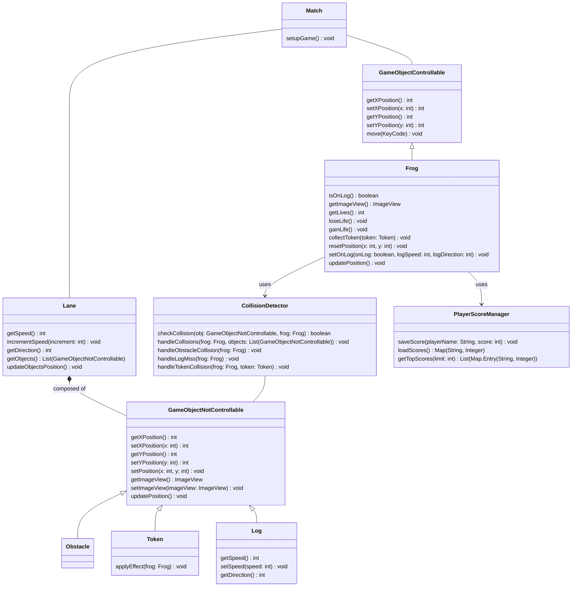
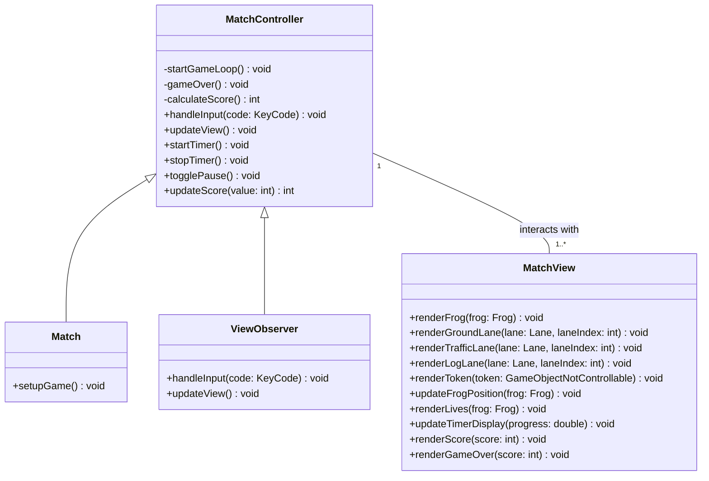
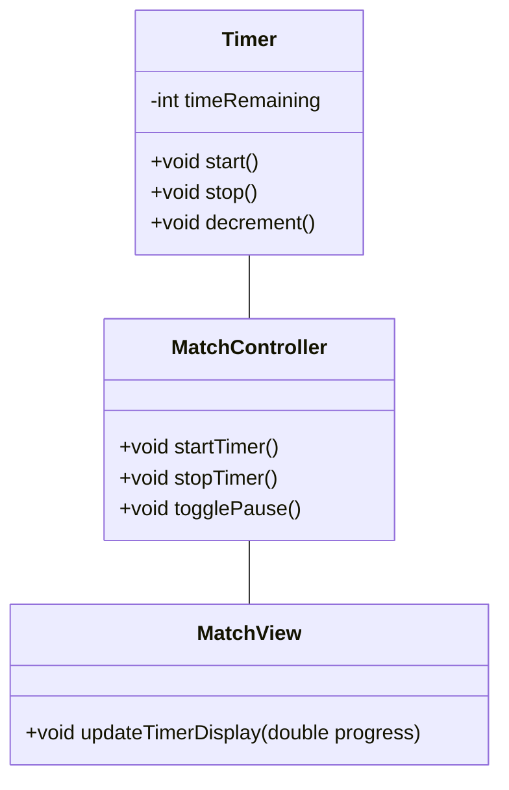
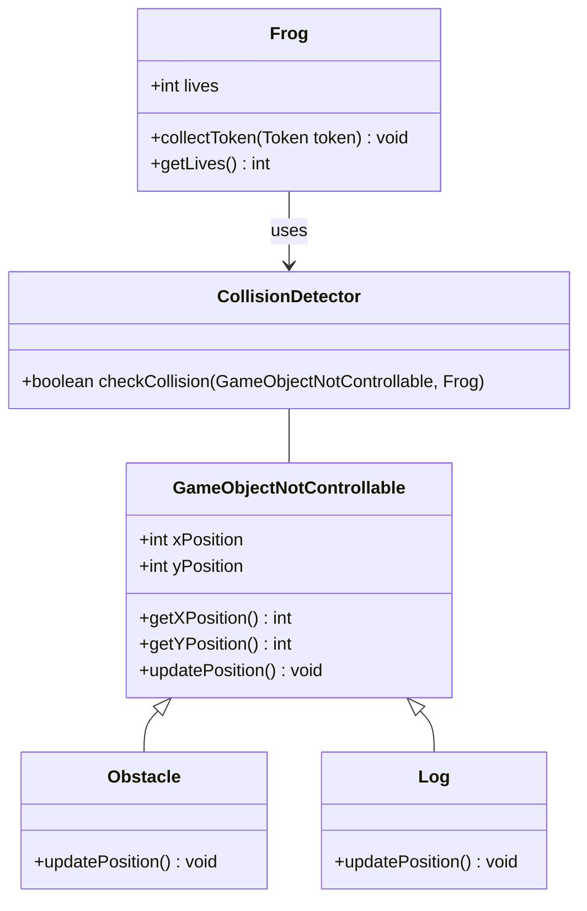

# Relazione del Progetto: Frogger

## Analisi

Il progetto consiste nella realizzazione di un videogioco ispirato al classico arcade *Frogger*. Si propone di realizzare una reinterpretazione del titolo originale, integrando meccaniche di gioco classiche con elementi di design innovativi per attrarre un pubblico ampio e diversificato. L'obiettivo principale è di guidare una rana attraverso diverse corsie trafficate evitando ostacoli, raccogliendo bonus strategici e completando il percorso entro un tempo limite.

Il gioco è strutturato su livelli con difficoltà progressiva. Le meccaniche principali includono un sistema di raccolta oggetti, un timer dinamico e la possibilità di salvare i punteggi dei giocatori per promuovere una sana competitività.

---

## Requisiti

### Requisiti funzionali
- **[RF1] Schermata Menù**: Offre le seguenti opzioni:
  - `New Game`: Inizia una nuova partita e reimposta i progressi.
  - `Settings`: Permette di regolare impostazioni come il volume.
  - `Quit`: Consente di uscire dall'applicazione in modo semplice e immediato.

- **[RF2] Inserimento Nome Giocatore**: Una schermata dedicata permette al giocatore di inserire il proprio nome prima dell'inizio della partita, garantendo che il punteggio venga salvato correttamente e possa essere confrontato nella classifica.

- **[RF3] Modalità di Gioco Classica**:
  - La rana si muove attraverso diverse corsie utilizzando i tasti freccia per navigare.
  - Elementi in movimento, come: 
    - veicoli: generano le collisioni e devono essere evitati per completare il livello
    - tronchi: utilizzati come vettori per spostarsi e attraversare i corsi d'acqua.
  - Possibilità di raccogliere gettoni che forniscono bonus, come estensioni del tempo o vite extra.

- **[RF4] Sistema di Collisione**:
  - La partita termina se la rana collide con un ostacolo e non dispone di altre vite o se il tempo a disposizione si esaurisce. Viene mostrata una schermata di `Game Over` con il punteggio ottenuto.

- **[RF5] Countdown Temporale**: Un timer visibile in basso allo schermo tiene traccia del tempo rimanente. Il conto alla rovescia aggiunge tensione e strategia al gameplay.

- **[RF6] Schermata di `Game Over`**:
  - Visualizza il punteggio raggiunto e offre opzioni per iniziare una nuova partita o chiudere il gioco.

### Funzionalità opzionali
- Livelli con difficoltà crescente che aumentano progressivamente la velocità e la densità degli ostacoli, introducendo nuove sfide a ogni progresso.
- Tronchi mobili per attraversare corsi d'acqua e altre meccaniche di navigazione strategica.
- Una classifica persistente per mostrare i migliori punteggi ottenuti dai giocatori.
- Condivisione sui social media dei risultati della partita, favorendo il coinvolgimento della community.
- Modalità di gioco personalizzabili con opzioni avanzate nel menù delle impostazioni.

---

## Analisi e modello del dominio

Il dominio di *Frogger* si basa su un insieme di entità principali, ciascuna con responsabilità e comportamenti specifici. Queste entità, come la rana, le corsie, gli ostacoli e i gettoni, lavorano insieme per creare una dinamica di gioco coinvolgente e strategica.

Gli elementi costitutivi il problema sono sintetizzati nella seguente figura.



Ogni classe definisce un comportamento specifico:
- **Match**: coordinatore principale del flusso di gioco. Responsabile dell’inizio del match e del collegamento tra le varie entità.
- **Frog**: rappresenta il personaggio principale controllato dal giocatore e fornisce le funzioni di movimento, raccolta dei gettoni e gestione delle vite.
- **Lane**: definisce una corsia di gioco con una velocità e una direzione specifiche composta da elementi non controllabili.
- **GameObjectNotControllable**: classe base per gli oggetti non controllabili. Possono essere ostacoli, tronchi o gettoni.
- **Obstacle**: definisce gli elementi dinamici del percorso che determinano le collisioni.
- **Token**: introduce elementi strategici attraverso effetti bonus.
- **Log**: rappresenta un elemento in movimento che può essere utilizzato come mezzo di trasporto tra 2 sponde.
- **CollisionDetector**: verifica se la posizione della rana è valida utilizzando bounding boxes per rilevare le collisioni.
- **PlayerScoreManager**: gestisce il salvataggio e il caricamento dei punteggi dei giocatori, e fornisce i migliori punteggi

Questa struttura consente una chiara separazione delle responsabilità, facilitando la manutenzione e l'espansione del progetto.

---

## Design

### Architettura

Il design del gioco segue il pattern MVC (Model-View-Controller), una scelta che garantisce modularità e facilita l'evoluzione del progetto. Ogni componente ha ruoli ben definiti:



- **Model**: Si occupa della logica del gioco e dello stato delle entità, come la posizione della rana e il timer.
- **View**: Rende l'esperienza visiva, occupandosi del disegno grafico e dell'interfaccia utente.
- **Controller**: Gestisce l'input dell'utente, traducendolo in azioni sul Model e aggiornamenti della View.

### Design dettagliato

#### Gestione del Timer
**Problema**: Garantire un sistema di countdown efficace e sincronizzato con il gameplay.

**Soluzione**:  Implementazione di un `Timeline` che aggiorna periodicamente il timer e notifica la View per aggiornare il display.



#### Collision Detection

##### Problema

Nel gioco, la rana si muove lungo le corsie evitando gli ostacoli o saltando su tronchi. Diventa quindi essenziale:
- verificare la validità di ogni movimento (non fuori dai bordi dello schermo o su una posizione occupata da un ostacolo).
- rilevare le collisioni con oggetti dinamici (es. veicoli).
- garantire fluidità nel gameplay mantenendo un'implementazione efficiente.

##### Soluzione

Il movimento è gestito dalla classe `Frog`, che calcola la nuova posizione in base alla direzione ricevuta. La classe `CollisionDetector` verifica se la posizione è valida utilizzando bounding boxes. Questa separazione migliora la modularità: `Frog` si occupa solo del movimento, mentre il `CollisionDetector` si concentra sulla logica di interazione.

##### Motivazioni

Separare il movimento e il rilevamento delle collisioni migliora la leggibilità e facilita i test unitari.
L’uso del sistema di bounding boxes per le collisioni è stato scelto per la sua semplicità ed efficienza.



---

## Sviluppo

### Testing automatizzato

Per garantire la qualità del codice, sono stati implementati test automatizzati utilizzando JUnit. Questi test coprono vari aspetti del gioco, tra cui:
- **Collisioni**: Verifica della corretta gestione degli impatti tra rana e ostacoli.
- **Timer**: Controllo della precisione del countdown e della sua sincronizzazione.
- **Gestione dei Punteggi**: Validazione del calcolo e della memorizzazione dei punteggi.

Esempio di test JUnit:
```java
@Test
public void testCollisionDetection() {
    Frog frog = new Frog(10, 10, 10, 10);
    Obstacle obstacle = new Obstacle(15, 15, 10, 10);
    CollisionDetector detector = new CollisionDetector();
    assertTrue(detector.checkCollision(frog, obstacle));
}
```

### Note di sviluppo

#### Vanni
- Creazione grafica degli sprite.
- Implementazione del posizionamento dinamico degli ostacoli.
- Gestione del timer e del punteggio.

#### Rambaldi
- Implementazione del movimento della rana:

    **Dove**: `it.unibo.frogger.core.Frog.java`

    **Permalink**: https://github.com/giuliavanni/frogger/blob/1d10c8c0ae71e38e5fc2c4439c5275373cc27e5f/src/main/java/it/unibo/frogger/core/Frog.java#L93-L118

    **Snippet**:
```java
public void move(final KeyCode code) {
    switch (code) {
        case UP:
            setYPosition(getYPosition() - GlobalVariables.JUMP_SIZE);
            break;
        case DOWN:
            setYPosition(getYPosition() + GlobalVariables.JUMP_SIZE);
            break;
        case LEFT:
            setXPosition(getXPosition() - GlobalVariables.JUMP_SIZE);
            break;
        case RIGHT:
            setXPosition(getXPosition() + GlobalVariables.JUMP_SIZE);
            break;
        default:
            break;
    }
    // Limit movement within window boundaries
    setXPosition(Math.max(0, Math.min(getXPosition(), GlobalVariables.WIDTH - GlobalVariables.JUMP_SIZE)));
    setYPosition(Math.max(0, Math.min(getYPosition(), GlobalVariables.HEIGHT - GlobalVariables.JUMP_SIZE)));
    imageView.setX(getXPosition());
    imageView.setY(getYPosition());
}
```
Ho implementato il movimento della rana utilizzando i tasti freccia per navigare attraverso le corsie e l'ho limitato alla dimensione della finestra.

- Sviluppo della logica di collisione.

    **Dove**: `it.unibo.frogger.core.CollisionDetector.java`

    **Permalink**: https://github.com/giuliavanni/frogger/blob/1d10c8c0ae71e38e5fc2c4439c5275373cc27e5f/src/main/java/it/unibo/frogger/controller/CollisionDetector.java#L28-L46

    **Snippet**:
```java
public boolean checkCollision(final GameObjectNotControllable obj, final Frog frog) {
    // Add some tolerance to the collision detection
    double frogWidth = frog.getImageView().getFitWidth() * 0.8; // Reduce hitbox by 20%
    double frogHeight = frog.getImageView().getFitHeight() * 0.8;
    double objWidth = obj.getImageView().getFitWidth() * 0.8;
    double objHeight = obj.getImageView().getFitHeight() * 0.8;

    // Add offset to center the hitbox
    double frogX = frog.getXPosition() + (frog.getImageView().getFitWidth() - frogWidth) / 2;
    double frogY = frog.getYPosition() + (frog.getImageView().getFitHeight() - frogHeight) / 2;
    double objX = obj.getXPosition() + (obj.getImageView().getFitWidth() - objWidth) / 2;
    double objY = obj.getYPosition() + (obj.getImageView().getFitHeight() - objHeight) / 2;

    // Check for rectangle intersection with adjusted positions and sizes
    return !(frogX + frogWidth <= objX     // frog is to the left
            || objX + objWidth <= frogX       // frog is to the right
            || frogY + frogHeight <= objY     // frog is above
            || objY + objHeight <= frogY);      // frog is below
}
```
Ho sviluppato la logica di collisione utilizzando bounding boxes per rilevare le collisioni tra la rana e gli ostacoli.

- Persistenza dei dati per i punteggi.

    **Dove**: `it.unibo.frogger.core.PlayerScoreManager.java`

    **Permalink**: https://github.com/giuliavanni/frogger/blob/1d10c8c0ae71e38e5fc2c4439c5275373cc27e5f/src/main/java/it/unibo/frogger/core/PlayerScoreManager.java#L30-L37

    **Snippet**:
```java
public static void saveScore(final String playerName, final int score) {
    try (BufferedWriter writer = new BufferedWriter(new FileWriter(SCORES_FILE, true))) {
        writer.write(playerName + ":" + score);
        writer.newLine();
    } catch (IOException e) {
        e.printStackTrace();
    }
}
```
Ho implementato la persistenza dei dati per i punteggi dei giocatori, permettendo di salvare e caricare i punteggi da un file.

---

## Commenti finali

### Autovalutazione e lavori futuri

#### Rambaldi
Grazie a quest progetto, ho avuto l'opportunità di approfondire la programmazione orientata agli oggetti. Inizialmente, ho trovato difficoltà a comprendere e applicare i concetti, diversi da quelli utilizzati in altri linguaggi. Tuttavia, con il tempo e la pratica, sono riuscito a superare queste difficoltà e a contribuire in modo significativo al progetto.
Uno dei punti di forza del lavoro è stata la fase di analisi del dominio. Anche se abbiamo speso molto tempo in questa fase, si è rivelata fondamentale per la realizzazione del codice. La comprensione approfondita delle entità e delle loro interazioni ci ha permesso di progettare un'architettura solida e ben strutturata, facilitando così lo sviluppo e la manutenzione del codice.
Ho avuto alcune difficoltà nella gestione delle collisioni con i tronchi. Realizzare una logica di collisione precisa e affidabile si è rivelato più complesso del previsto. In particolar modo per quanto riguarda il movimento della rana sui tronchi in movimento. Grazie al lavoro di gruppo, però, siamo riusciti a trovare una soluzione adeguata.

La fase di analisi del dominio è stata particolarmente impegnativa, ma si è rivelata estremamente utile per la realizzazione del codice. Vorrei suggerire di dedicare più tempo e risorse a questa fase nei futuri corsi, in quanto può davvero fare la differenza nella qualità del progetto finale.

---

## Guida utente

1. Avviare il gioco e scegliere un'opzione dal menù principale (`New Game`, `Settings`, `Quit`).
2. Inserire il proprio nome per salvare i progressi.
3. Utilizzare i tasti freccia per muovere la rana e attraversare le corsie.
4. Raccogliere gettoni per bonus di vite extra.
5. Alla fine della partita, visualizzare il punteggio e scegliere se riprovare o uscire.

---